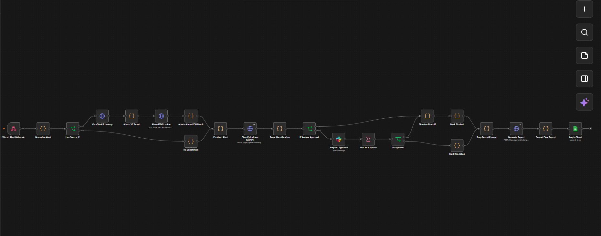

# AI Cyber Defense – Alert to Response

An automated AI-assisted cyber defense workflow built with **n8n**. The system receives security alerts, enriches them with external threat-intelligence sources, uses Google Gemini to classify the incident, determines whether automated response or analyst approval is required, generates an incident report, and logs the result.



## Architecture

```text
                 ┌─────────────────────┐
                 │   Wazuh Security    │
                 │       Alert         │
                 └──────────┬──────────┘
                            │
                            ▼
                 ┌─────────────────────┐
                 │  Normalize Alert    │
                 └──────────┬──────────┘
                            │
                            ▼
                 ┌─────────────────────┐
                 │   Source IP Check   │
                 └───────┬────────┬────┘
                         │        │
                    Has IP?       │ No IP
                         │        │
                         ▼        ▼
                 ┌────────────┐  ┌──────────────┐
                 │ VirusTotal │  │ No Enrichment│
                 │ IP Lookup  │  └──────┬───────┘
                 └──────┬─────┘         │
                        ▼                │
                 ┌────────────┐          │
                 │ AbuseIPDB  │          │
                 │ IP Lookup  │          │
                 └──────┬─────┘          │
                        │                │
                        └───────┬────────┘
                                ▼
                    ┌──────────────────────┐
                    │    Gemini AI         │
                    │ Incident Classifier  │
                    └──────────┬───────────┘
                               │
                               ▼
                    ┌──────────────────────┐
                    │ Severity Decision    │
                    └──────────┬───────────┘
                               │
                  ┌────────────┴────────────┐
                  │                         │
             Low/Medium                 High/Critical
                  │                         │
                  ▼                         ▼
          ┌───────────────┐       ┌─────────────────┐
          │ Simulated     │       │ Analyst Approval│
          │ IP Block      │       │ via Slack       │
          └───────┬───────┘       └────────┬────────┘
                  │                        │
                  │                 ┌──────┴──────┐
                  │                 │             │
                  │              Approve        Deny
                  │                 │             │
                  │                 ▼             ▼
                  │          ┌─────────────┐ ┌────────────┐
                  │          │ Simulated   │ │ No Action  │
                  │          │ IP Block    │ │            │
                  │          └──────┬──────┘ └─────┬──────┘
                  │                 │              │
                  └─────────────────┴──────┬───────┘
                                           ▼
                                ┌────────────────────┐
                                │ Gemini AI Report   │
                                │ Generation         │
                                └─────────┬──────────┘
                                          ▼
                                ┌────────────────────┐
                                │ Google Sheets      │
                                │ Incident Logging   │
                                └────────────────────┘
```

## What the System Does

### 1. Alert ingestion

The workflow receives security alerts through an n8n webhook designed to accept Wazuh-style alert data.

### 2. Alert normalization

Incoming alert data is normalized into a consistent structure containing information such as:

* Alert ID
* Timestamp
* Source IP
* Destination IP
* Rule description
* Rule severity/level
* Original alert data

### 3. Threat intelligence enrichment

When a source IP is available, the workflow queries:

* **VirusTotal** for IP reputation and malicious detection information
* **AbuseIPDB** for abuse confidence and historical report information

If no source IP is available, the workflow continues without external IP enrichment.

### 4. AI-powered incident classification

The enriched alert is sent to **Google Gemini** for security incident classification.

The classifier returns:

* Severity
* Incident type
* MITRE ATT&CK technique
* Confidence score
* Reasoning

The workflow expects the AI response in a structured JSON format.

### 5. Automated response / analyst approval

The workflow uses the AI-determined severity to decide how the incident should proceed.

Lower-severity incidents can proceed through the automated response path.

Higher-severity incidents are sent to **Slack for analyst approval** before the response action is taken.

This creates a human-in-the-loop security workflow rather than allowing the AI to independently make irreversible security decisions.

### 6. Safe response simulation

The current version intentionally uses a **simulated IP-blocking action**.

No real firewall or network device is modified.

Instead, the workflow records what would have happened. This makes the system safe to demonstrate and test without accidentally blocking legitimate infrastructure.

### 7. AI-generated incident report

After the response decision, Google Gemini generates a concise incident report containing:

* Summary
* Timeline
* Evidence
* Classification
* Action taken
* Recommended next steps

### 8. Incident logging

The resulting incident information is logged to Google Sheets for tracking and review.

## Technologies Used

| Technology    | Purpose                                 |
| ------------- | --------------------------------------- |
| n8n Cloud     | Workflow automation and orchestration   |
| Wazuh         | Security alert source                   |
| VirusTotal    | IP threat intelligence                  |
| AbuseIPDB     | IP reputation and abuse intelligence    |
| Google Gemini | AI classification and report generation |
| Slack         | Analyst approval workflow               |
| Google Sheets | Incident logging                        |

## Key Features

* Automated security alert processing
* Threat intelligence enrichment
* AI-assisted incident classification
* MITRE ATT&CK technique identification
* Severity-based response routing
* Human approval for higher-risk incidents
* Simulated containment action
* AI-generated incident reports
* Centralized incident logging
* Graceful handling of alerts without source IP information

## Example Workflow

A typical alert follows this process:

```text
Wazuh Alert
    ↓
Normalize Alert
    ↓
Check Source IP
    ↓
VirusTotal + AbuseIPDB
    ↓
Gemini Classification
    ↓
Severity Decision
    ↓
┌─────────────────────────┐
│ Low / Medium            │
│ Automated Response      │
└─────────────────────────┘

             OR

┌─────────────────────────┐
│ High / Critical         │
│ Slack Analyst Approval  │
└─────────────────────────┘
    ↓
Response Decision
    ↓
AI Incident Report
    ↓
Google Sheets Logging
```

## Repository Contents

```text
.
├── README.md
├── workflow.json
└── screenshots/
    └── workflow-overview.png
```

> The workflow JSON contains the n8n workflow structure. API credentials and secret values are intentionally not included.

## Security & Privacy

This repository does **not** contain API keys, passwords, OAuth tokens, or other authentication secrets.

Credentials should be configured separately inside n8n.

The workflow uses simulated response actions for demonstration purposes. It does not directly connect to or modify a production firewall.

## Important Note

This project is a demonstration/prototype of an AI-assisted security operations workflow.

AI-generated classifications should be treated as decision support rather than an unquestionable source of truth. The human approval path provides an additional safeguard for higher-risk incidents.

## Demo

The workflow can be demonstrated by sending a Wazuh-style security alert to the n8n webhook.

Example input:

```json
{
  "id": "demo-alert-001",
  "timestamp": "2026-09-11T12:00:00Z",
  "srcip": "8.8.8.8",
  "dstip": "192.168.1.10",
  "description": "Suspicious network connection detected",
  "level": 10
}
```

## Project Goal

The goal of this project is to demonstrate how workflow automation, threat intelligence, AI-assisted analysis, and human oversight can be combined to reduce the time required to process and respond to security alerts.

---

**Built with n8n, Wazuh, VirusTotal, AbuseIPDB, Google Gemini, Slack, and Google Sheets.**
